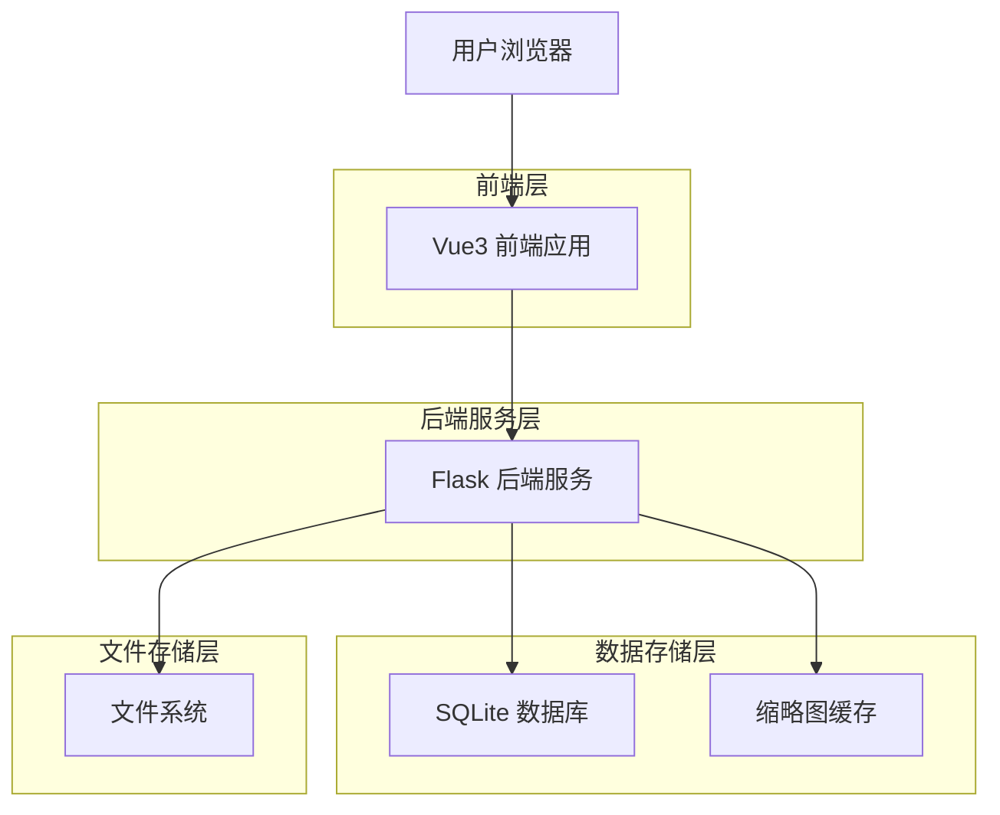
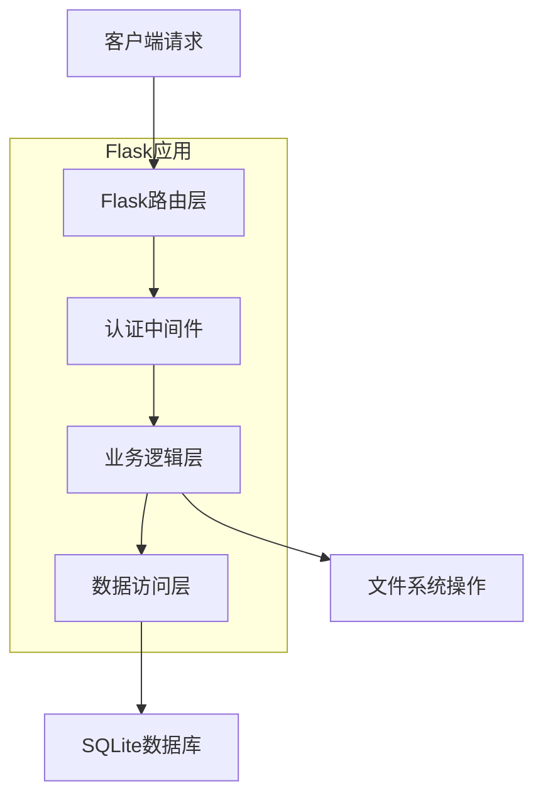
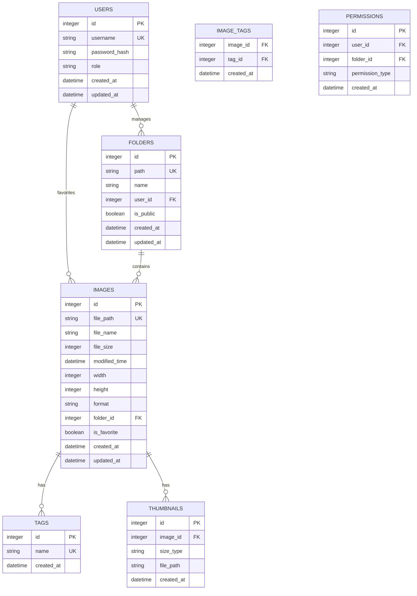
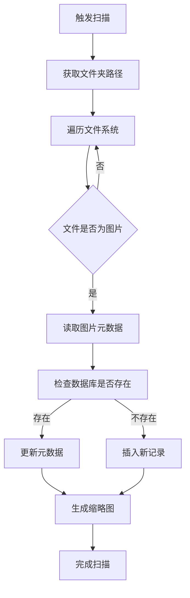
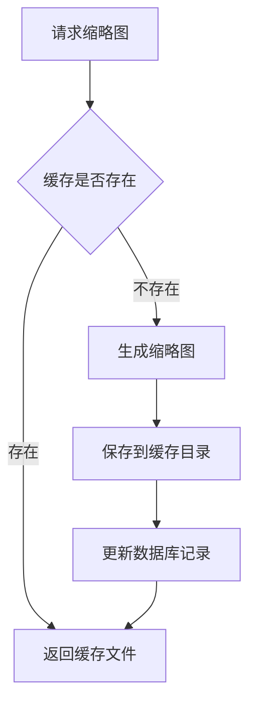

# PictureWeb 技术架构文档

## 1. 架构设计



## 2. 技术栈描述

- **前端**: Vue3 + Vite7 + Element Plus
- **初始化工具**: Vite
- **后端**: Python + Flask
- **数据库**: SQLite3
- **部署模式**: 非前后端分离，Flask托管静态资源

## 3. 路由定义

| 路由 | 用途 |
|------|------|
| / | 主页，显示图片瀑布流 |
| /login | 登录页面 |
| /admin | 管理员面板 |
| /api/* | API接口前缀 |

## 4. API接口定义

### 4.1 用户认证相关

```
POST /api/auth/login
```

请求参数:
| 参数名 | 参数类型 | 是否必需 | 描述 |
|--------|----------|----------|------|
| username | string | 是 | 用户名 |
| password | string | 是 | 密码 |

响应参数:
| 参数名 | 参数类型 | 描述 |
|--------|----------|------|
| token | string | JWT令牌 |
| role | string | 用户角色 |

### 4.2 文件夹管理

```
GET /api/folders
```
获取文件夹列表

```
POST /api/folders
```
添加新文件夹路径

### 4.3 图片管理

```
GET /api/images
```
获取图片列表，支持分页和过滤

```
GET /api/images/{id}
```
获取图片详情

```
PUT /api/images/{id}
```
更新图片信息（标签、名称等）

```
DELETE /api/images/{id}
```
删除图片（移动到回收站）

### 4.4 搜索功能

```
GET /api/search
```
搜索图片，支持关键词、标签、日期范围等

## 5. 服务器架构图



## 6. 数据模型

### 6.1 数据模型定义



### 6.2 数据定义语言

#### 用户表 (users)
```sql
CREATE TABLE users (
    id INTEGER PRIMARY KEY AUTOINCREMENT,
    username VARCHAR(50) UNIQUE NOT NULL,
    password_hash VARCHAR(255) NOT NULL,
    role VARCHAR(20) DEFAULT 'user' CHECK (role IN ('admin', 'user', 'guest')),
    created_at TIMESTAMP DEFAULT CURRENT_TIMESTAMP,
    updated_at TIMESTAMP DEFAULT CURRENT_TIMESTAMP
);

CREATE INDEX idx_users_username ON users(username);
```

#### 文件夹表 (folders)
```sql
CREATE TABLE folders (
    id INTEGER PRIMARY KEY AUTOINCREMENT,
    path TEXT UNIQUE NOT NULL,
    name VARCHAR(255) NOT NULL,
    user_id INTEGER,
    is_public BOOLEAN DEFAULT FALSE,
    created_at TIMESTAMP DEFAULT CURRENT_TIMESTAMP,
    updated_at TIMESTAMP DEFAULT CURRENT_TIMESTAMP,
    FOREIGN KEY (user_id) REFERENCES users(id)
);

CREATE INDEX idx_folders_path ON folders(path);
CREATE INDEX idx_folders_user_id ON folders(user_id);
```

#### 图片表 (images)
```sql
CREATE TABLE images (
    id INTEGER PRIMARY KEY AUTOINCREMENT,
    file_path TEXT UNIQUE NOT NULL,
    file_name VARCHAR(255) NOT NULL,
    file_size INTEGER,
    modified_time TIMESTAMP,
    width INTEGER,
    height INTEGER,
    format VARCHAR(10),
    folder_id INTEGER,
    is_favorite BOOLEAN DEFAULT FALSE,
    created_at TIMESTAMP DEFAULT CURRENT_TIMESTAMP,
    updated_at TIMESTAMP DEFAULT CURRENT_TIMESTAMP,
    FOREIGN KEY (folder_id) REFERENCES folders(id)
);

CREATE INDEX idx_images_file_path ON images(file_path);
CREATE INDEX idx_images_folder_id ON images(folder_id);
CREATE INDEX idx_images_modified_time ON images(modified_time);
```

#### 标签表 (tags)
```sql
CREATE TABLE tags (
    id INTEGER PRIMARY KEY AUTOINCREMENT,
    name VARCHAR(50) UNIQUE NOT NULL,
    created_at TIMESTAMP DEFAULT CURRENT_TIMESTAMP
);
```

#### 图片标签关联表 (image_tags)
```sql
CREATE TABLE image_tags (
    image_id INTEGER,
    tag_id INTEGER,
    created_at TIMESTAMP DEFAULT CURRENT_TIMESTAMP,
    PRIMARY KEY (image_id, tag_id),
    FOREIGN KEY (image_id) REFERENCES images(id) ON DELETE CASCADE,
    FOREIGN KEY (tag_id) REFERENCES tags(id) ON DELETE CASCADE
);
```

#### 缩略图表 (thumbnails)
```sql
CREATE TABLE thumbnails (
    id INTEGER PRIMARY KEY AUTOINCREMENT,
    image_id INTEGER NOT NULL,
    size_type VARCHAR(20) NOT NULL,
    file_path TEXT NOT NULL,
    created_at TIMESTAMP DEFAULT CURRENT_TIMESTAMP,
    FOREIGN KEY (image_id) REFERENCES images(id) ON DELETE CASCADE,
    UNIQUE(image_id, size_type)
);

CREATE INDEX idx_thumbnails_image_id ON thumbnails(image_id);
```

#### 权限表 (permissions)
```sql
CREATE TABLE permissions (
    id INTEGER PRIMARY KEY AUTOINCREMENT,
    user_id INTEGER NOT NULL,
    folder_id INTEGER NOT NULL,
    permission_type VARCHAR(20) NOT NULL CHECK (permission_type IN ('read', 'write', 'delete', 'rename')),
    created_at TIMESTAMP DEFAULT CURRENT_TIMESTAMP,
    FOREIGN KEY (user_id) REFERENCES users(id) ON DELETE CASCADE,
    FOREIGN KEY (folder_id) REFERENCES folders(id) ON DELETE CASCADE,
    UNIQUE(user_id, folder_id, permission_type)
);
```

## 7. 前端架构

### 7.1 组件层次结构

```
src/
├── components/
│   ├── layout/
│   │   ├── Sidebar.vue      # 侧边栏
│   │   ├── TopBar.vue       # 顶部搜索栏
│   │   └── StatusBar.vue    # 底部状态栏
│   ├── image/
│   │   ├── ImageCard.vue    # 图片卡片
│   │   ├── ImageGrid.vue    # 图片网格
│   │   └── Lightbox.vue     # 图片详情灯箱
│   └── common/
│       ├── VirtualList.vue  # 虚拟滚动列表
│       └── Loading.vue      # 加载组件
├── views/
│   ├── Home.vue             # 主页
│   ├── Login.vue            # 登录页
│   └── Admin.vue            # 管理页
├── stores/
│   ├── user.js              # 用户状态管理
│   ├── images.js            # 图片数据管理
│   └── folders.js           # 文件夹数据管理
└── utils/
    ├── api.js               # API封装
    └── image.js             # 图片处理工具
```

### 7.2 状态管理

使用 Pinia 进行状态管理：

- **userStore**: 管理用户登录状态、权限信息
- **imageStore**: 管理图片数据、加载状态、筛选条件
- **folderStore**: 管理文件夹结构、选中状态

## 8. 核心逻辑流程

### 8.1 图片扫描流程



### 8.2 缩略图生成流程



## 9. 目录结构

```
PictureWeb/
├── backend/
│   ├── app/
│   │   ├── __init__.py
│   │   ├── models/          # 数据模型
│   │   ├── routes/          # API路由
│   │   ├── services/        # 业务逻辑
│   │   └── utils/           # 工具函数
│   ├── config.py            # 配置文件
│   ├── requirements.txt     # Python依赖
│   └── run.py              # 启动脚本
├── frontend/
│   ├── src/
│   │   ├── components/      # Vue组件
│   │   ├── views/          # 页面组件
│   │   ├── stores/         # 状态管理
│   │   └── utils/          # 工具函数
│   ├── public/             # 静态资源
│   ├── package.json        # NPM依赖
│   └── vite.config.js      # Vite配置
├── data/
│   ├── database.db         # SQLite数据库
│   ├── cache/             # 缩略图缓存
│   └── trash/              # 回收站
├── config.yaml             # 系统配置
└── logs/                   # 日志文件
```

## 10. 性能优化策略

### 10.1 数据库优化
- 使用合适的索引策略
- 定期VACUUM清理数据库
- 使用预编译语句

### 10.2 前端优化
- 虚拟滚动技术
- 图片懒加载
- 防抖节流处理

### 10.3 后端优化
- 异步处理扫描任务
- 连接池管理
- 缓存策略